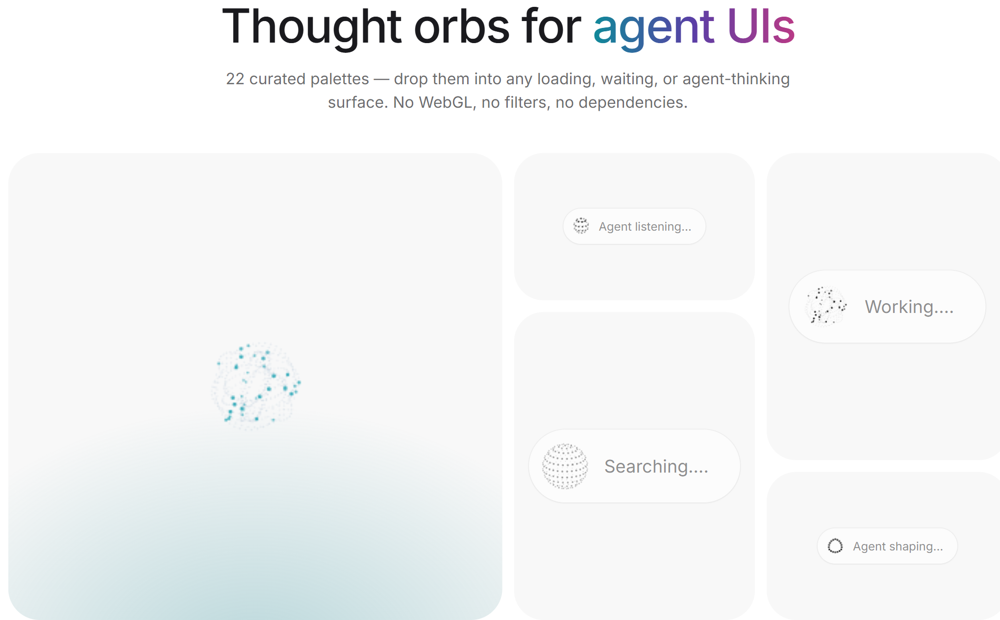
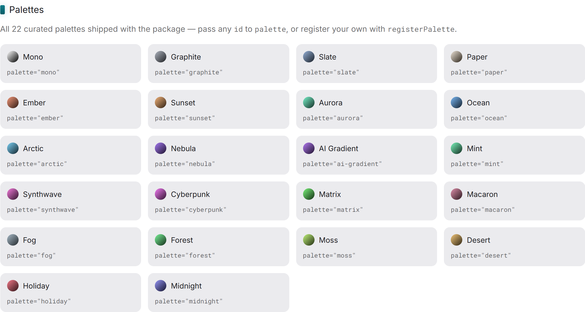
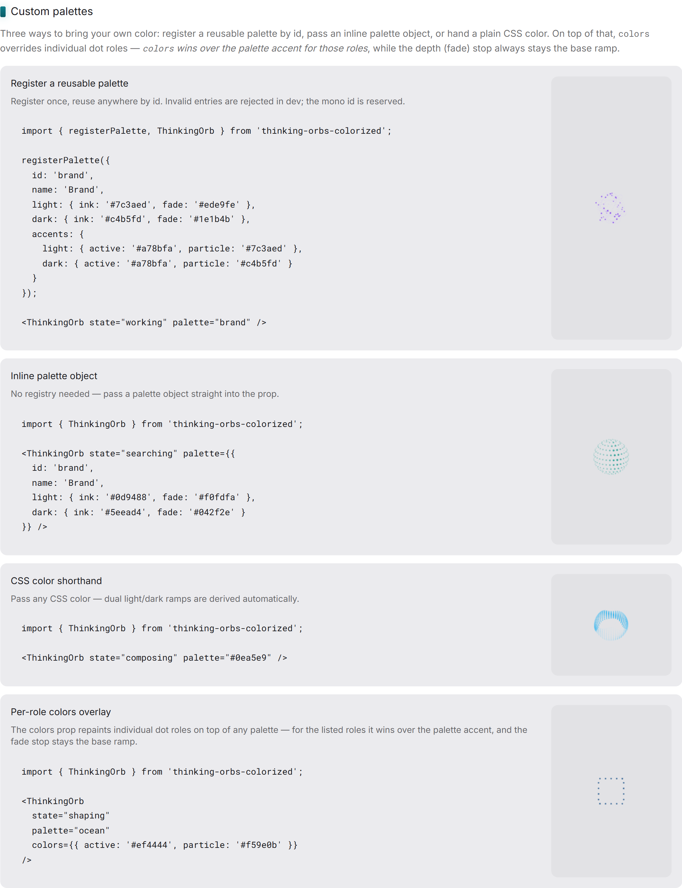

# thinking-orbs-colorized

[](https://www.npmjs.com/package/thinking-orbs-colorized)
[](LICENSE)

Dotted thought-orb loading indicators for AI & agent UIs. Six hand-tuned animated states at two purpose-tuned sizes, auto dark/light, **22 curated color palettes** — rendered on a plain 2D canvas, no WebGL, no filters, identical in Chrome, Safari and Firefox.

> **A colorized fork of [thinking-orbs](https://github.com/Jakubantalik/thinking-orbs) by Jakub Antalik** — the original dotted thought-orb library this project builds upon. All engine credit goes to the original work; this fork adds color palettes, a product site, and bilingual docs on top of it.

[Live demo](https://bardolog1.github.io/thinking-orbs-colorized/) · [Repository](https://github.com/Bardolog1/thinking-orbs-colorized) · [Report an issue](https://github.com/Bardolog1/thinking-orbs-colorized/issues) · [Español](README.es.md)



## Features

- **Six states** — `working`, `searching`, `solving`, `listening`, `composing`, `shaping`; each a distinct, hand-tuned animation.
- **Two tuned sizes** — `64` for chat-avatar scale, `20` for inline text. Separate designs, not a scale factor.
- **Auto dark/light** — resolves from your project's theme (Tailwind/shadcn `dark` class or `data-theme`) or the OS, live-updating.
- **22 curated palettes** — or pass any CSS color and get derived ramps; register your own with `registerPalette`.
- **Accessible** — `role="img"` with per-state `aria-label`, `prefers-reduced-motion` support.
- **Performant** — pauses offscreen & in hidden tabs, shares one clock, DPR capped at 2, zero dependencies.
- **SSR-safe** — the canvas only paints on the client.

## Install

```bash
npm install thinking-orbs-colorized
```

## Quick start

```tsx
import { ThinkingOrb } from 'thinking-orbs-colorized';

function Status() {
  return <ThinkingOrb state="searching" size={64} palette="ocean" />;
}
```

## States

Six verbs an agent can be doing, each a distinct animation:

```tsx
<ThinkingOrb state="working" />    {/* particles on tilted orbits */}
<ThinkingOrb state="searching" />  {/* a scan meridian sweeps a dotted globe */}
<ThinkingOrb state="solving" />    {/* bands scramble, then click back solved */}
<ThinkingOrb state="listening" />  {/* a waveform rolls through the rings */}
<ThinkingOrb state="composing" />  {/* an undulating multi-band sash */}
<ThinkingOrb state="shaping" />    {/* dotted outline: circle → triangle → square */}
```

## Sizes

Two tuned presets — separate designs, not a scale factor. `64` for chat-avatar scale, `20` for inline-text scale. Each carries its own dot count, dot size and speed tuning:

```tsx
<ThinkingOrb state="working" size={64} />
<ThinkingOrb state="working" size={20} />
```

## Theme

`auto` (default) picks the mode from the host project and updates live — dark renders light ink (for dark backgrounds), light renders dark ink:

```tsx
<ThinkingOrb theme="auto" />   {/* default — detects from the project */}
<ThinkingOrb theme="dark" />   {/* pin: light dots for dark backgrounds */}
<ThinkingOrb theme="light" />  {/* pin: dark dots for light backgrounds */}
```

`auto` resolves in three layers:

1. an ancestor `data-theme="dark|light"` attribute or `dark`/`light` class (the Tailwind / shadcn convention), watched via `MutationObserver`;
2. otherwise `prefers-color-scheme`, subscribed for live OS theme switches;
3. SSR-safe — the canvas paints only on the client, after the theme has resolved.

## Colors & palettes

Omit `palette` for the classic monochrome orb. Pass any of the 22 curated palette ids, a CSS-color shorthand (dual light/dark ramps are auto-derived), or an inline palette object:

```tsx
<ThinkingOrb palette="ember" />
<ThinkingOrb palette="#0ea5e9" />                     {/* shorthand → derived ramps */}
<ThinkingOrb palette={{ id: 'brand', light: { ink: '#7c3aed', fade: '#ede9fe' }, dark: { ink: '#c4b5fd', fade: '#1e1b4b' } }} />
```



### The 22 curated palettes

Every palette is a same-hue **ink → fade** ramp per theme: light substrate gets dark ink on a pale fade, dark substrate gets light ink on a deep fade. Palettes marked **Accents** also paint `active`/`particle` (and sometimes `band`/`outline`) dots at a second hue — the fade stop always stays the base ramp's. Full accent values live in [`src/palette-data.ts`](src/palette-data.ts).

| Palette | id | Light (ink · fade) | Dark (ink · fade) | Accents |
| --- | --- | --- | --- | --- |
| Mono | `mono` |   |   | — |
| Graphite | `graphite` |   |   | — |
| Slate | `slate` |   |   | — |
| Paper | `paper` |   |   | — |
| Ember | `ember` |   |   | ✓ |
| Sunset | `sunset` |   |   | ✓ |
| Aurora | `aurora` |   |   | ✓ |
| Ocean | `ocean` |   |   | ✓ |
| Arctic | `arctic` |   |   | ✓ |
| Nebula | `nebula` |   |   | ✓ |
| AI Gradient | `ai-gradient` |   |   | ✓ |
| Mint | `mint` |   |   | ✓ |
| Synthwave | `synthwave` |   |   | ✓ |
| Cyberpunk | `cyberpunk` |   |   | ✓ |
| Matrix | `matrix` |   |   | ✓ |
| Macaron | `macaron` |   |   | ✓ |
| Fog | `fog` |   |   | ✓ |
| Forest | `forest` |   |   | ✓ |
| Moss | `moss` |   |   | ✓ |
| Desert | `desert` |   |   | ✓ |
| Holiday | `holiday` |   |   | ✓ |
| Midnight | `midnight` |   |   | ✓ |

### Per-role `colors` overlay

Override individual dot roles — wins over `palette` accents for the listed roles, and the depth (fade) stop stays the base ramp's:

```tsx
<ThinkingOrb palette="ocean" colors={{ active: '#ef4444', particle: '#f59e0b' }} />
```

Roles: `ghost`, `particle`, `field`, `active`, `band`, `outline`.

### Custom palettes with `registerPalette`

```ts
import { registerPalette } from 'thinking-orbs-colorized';

registerPalette({
  id: 'brand',
  name: 'Brand',
  light: { ink: '#7c3aed', fade: '#ede9fe' },
  dark: { ink: '#c4b5fd', fade: '#1e1b4b' }
});
// now usable: <ThinkingOrb palette="brand" />
```

Invalid palettes are rejected with a dev-only warning; `mono` is reserved and cannot be overridden. Unknown ids and unresolvable colors always fall back to `mono` with a dev warning — resolution never throws. See `docs/COLOR_PALETTEGuide.md` for the full API.



## Props

```tsx
<ThinkingOrb
  state="solving"       // 'working' | 'searching' | 'solving' | 'listening' | 'composing' | 'shaping'
  size={64}             // 64 | 20
  theme="auto"          // 'auto' | 'dark' | 'light'
  speed={1.5}           // multiplier on the preset's baked speed
  paused={false}        // freeze on the current frame
  palette="ocean"       // palette id, CSS color shorthand, or OrbPalette object
  colors={{ active: '#ef4444' }}  // per-role ink overlay
  aria-label="Analysing repository…"  // overrides the per-state default
/>
```

All other `<canvas>` props (`className`, `style`, `data-*`, …) pass through.

## Local Storybook

Explore every state, size, palette and control:

```bash
npm run storybook
```

Runs on `http://localhost:6006` — gallery, theme and Playground stories with live controls.

## Accessibility & performance

- `role="img"` with a sensible per-state `aria-label` out of the box.
- `prefers-reduced-motion: reduce` renders a static representative frame — no animation — and still follows the live theme.
- Every instance pauses automatically when scrolled offscreen (`IntersectionObserver`) or when the tab is hidden, and resumes in phase — all instances share one clock.
- Plain 2D canvas arcs only: no `ctx.filter`, no SVG filters, no WebGL — the same pixels everywhere, cheap on low-end devices. Device-pixel-ratio capped at 2.
- Palette resolution happens once per mount and degrades gracefully; the monochrome default keeps its byte-identical fast path.

## Author

Made by **Libardo Lozano** ([@Bardolog_1](https://x.com/Bardolog_1)) — a colorized fork of [thinking-orbs](https://github.com/Jakubantalik/thinking-orbs) by Jakub Antalik & Alex Brinza.

## License

MIT © Jakub Antalik — the original author and the work this fork is based on.

Copyright (c) 2026 Libardo Lozano (Bardolog1) — modifications, color palettes, site and docs.
